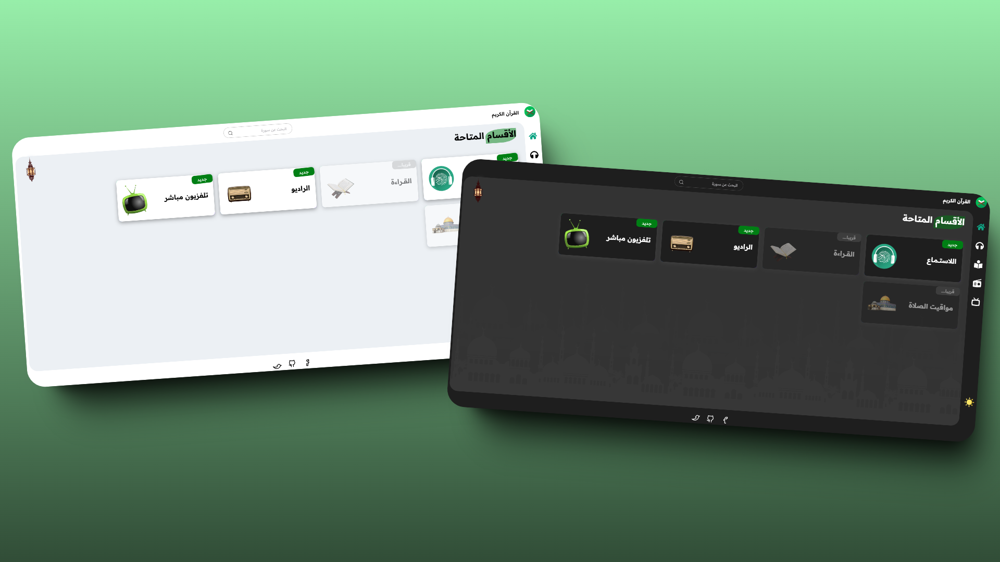

# تطبيق القرآن الكريم

تجربة عربية لقراءة القرآن بالسور والأجزاء، والاستماع إلى التلاوات والإذاعات، ومتابعة مواقيت الصلاة، وحفظ الآيات والأذكار اليومية.

## التشغيل

```bash
npm install
npm run dev
```

## التحقق قبل النشر

```bash
npm test
npm run lint
npm run build
```

يضبط بناء Vercel ملفات `sitemap.xml` و`robots.txt` تلقائيًا من `VERCEL_PROJECT_PRODUCTION_URL`. وللنطاق المخصص، أضف متغير البيئة `VITE_SITE_URL` بعنوان الموقع الكامل.

توجد قائمة المراجعة الشرعية المطلوبة قبل الإطلاق العام في [`docs/RELIGIOUS_CONTENT_REVIEW.md`](docs/RELIGIOUS_CONTENT_REVIEW.md).


